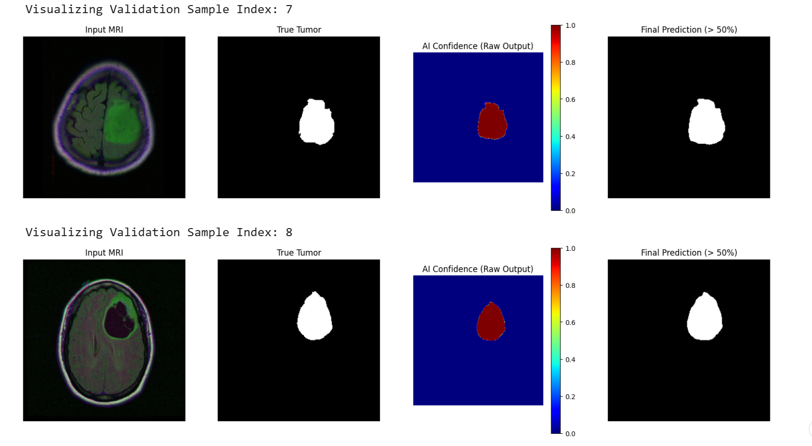
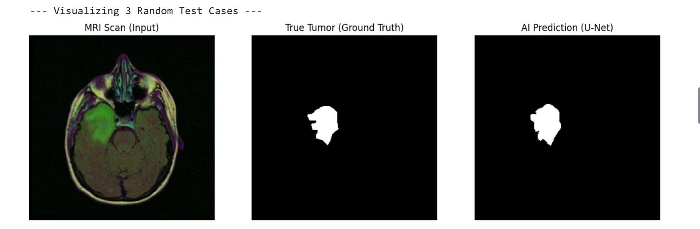
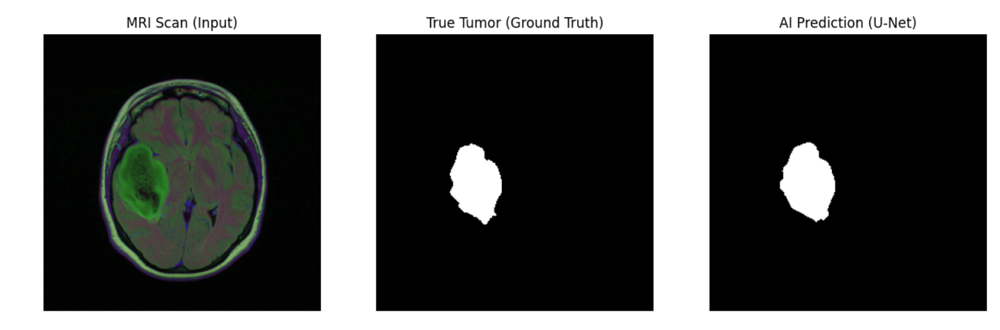

# 🧠 Brain Tumor Segmentation (U-Net)


A semantic segmentation model designed to automatically identify Lower-Grade Gliomas (LGG) in brain MRI scans. This project implements a **U-Net architecture** from scratch in PyTorch, tackling extreme class imbalance to achieve high sensitivity (Recall) for medical diagnostics.

### 🔎 Model Predictions (Visualizing Confidence)
Below are examples of the model's performance on unseen test data. The red areas in the heatmap indicate high model confidence in the presence of a tumor.

<table>
  <tr>
    <td align="center"></td>
    <td align="center"></td>
    <td align="center"></td>
  </tr>
</table>
<p align="center"><i>(Within each image above: Left=Original MRI, Middle=Ground Truth Label, Right=Model Prediction Heatmap)</i></p>

---

## 📌 Project Overview

**The Challenge:**
Manual segmentation of brain tumors is time-consuming and prone to inter-observer variability. Additionally, medical datasets are heavily imbalanced—tumor pixels often represent less than 1% of the image, causing standard models to bias towards the background (99% accuracy but 0% tumor detection).

**The Solution:**
I engineered a deep learning pipeline that prioritizes **Recall** (finding the cancer) over pure accuracy. By using a custom **Dice Loss** function and heavy data augmentation, the model learns to delineate exact tumor boundaries despite the small size of the targets.

## 📂 Dataset

**LGG MRI Segmentation Dataset**
* **Source:** [Kaggle - Mateusz Buda](https://www.kaggle.com/datasets/mateuszbuda/lgg-mri-segmentation)
* **Content:** 110 patients, ~3,900 MRI slices (RGB) with corresponding manual segmentation masks.
* **Preprocessing:** Images resized to 256x256 and normalized.

## ⚙️ Methodology & Strategy

### 1. Model Architecture: U-Net
I implemented the U-Net architecture (Ronneberger et al.) from scratch.
* **Encoder:** Captures high-level context (what is the object?).
* **Decoder:** Recovers spatial resolution (where is the object?).
* **Skip Connections:** Concatenate encoder features with decoder features to preserve fine edge details lost during downsampling.

### 2. Handling Class Imbalance (The "Dice" Strategy)
Standard Cross-Entropy loss fails here because the background dominates the loss function.
* **Loss Function:** `BCEWithLogitsLoss + DiceLoss`
* **Why?** Dice Loss directly optimizes the **overlap (Intersection over Union)** between prediction and ground truth, ignoring the massive black background.

### 3. Data Augmentation (Albumentations)
To prevent overfitting on the small dataset (110 patients), I applied:
* Random Rotations (±35°)
* Horizontal & Vertical Flips
* This forces the model to learn tumor *features* rather than memorizing *locations*.

## 📊 Results (After 28 Epochs)

The model was evaluated on a held-out test set.

| Metric | Score | Significance |
| :--- | :--- | :--- |
| **IoU (Intersection over Union)** | **0.7257** | High overlap with doctor's manual segmentation. |
| **Recall (Sensitivity)** | **0.8398** | **Crucial:** The model detects **84%** of all tumor tissue. |
| **Precision** | **0.8733** | Very low rate of false alarms. |
| **F1-Score** | **0.8562** | Excellent harmonic mean of precision and recall. |

### Classification Report (Pixel-wise)
```text
              precision    recall  f1-score   support

  Background     0.9984    0.9988    0.9986  25504188
       Tumor     0.8733    0.8398    0.8562    251460

    accuracy                         0.9972  25755648
   macro avg     0.9359    0.9193    0.9274  25755648
weighted avg     0.9972    0.9972    0.9972  25755648


**## 🛠️ Tech Stack**
Framework: PyTorch

Augmentation: Albumentations

Tracking: TQDM (Progress Bars)

Visualization: Matplotlib, OpenCV

Environment: Kaggle Kernels / Jupyter Notebook

**## 🚀 How to Run**
Clone the repository.

Install dependencies: pip install torch albumentations opencv-python matplotlib.

Download the dataset from Kaggle and update the path in the notebook.

Run brain-mri-unet.ipynb.

**👤 Author
M WASIF YASEEN**


